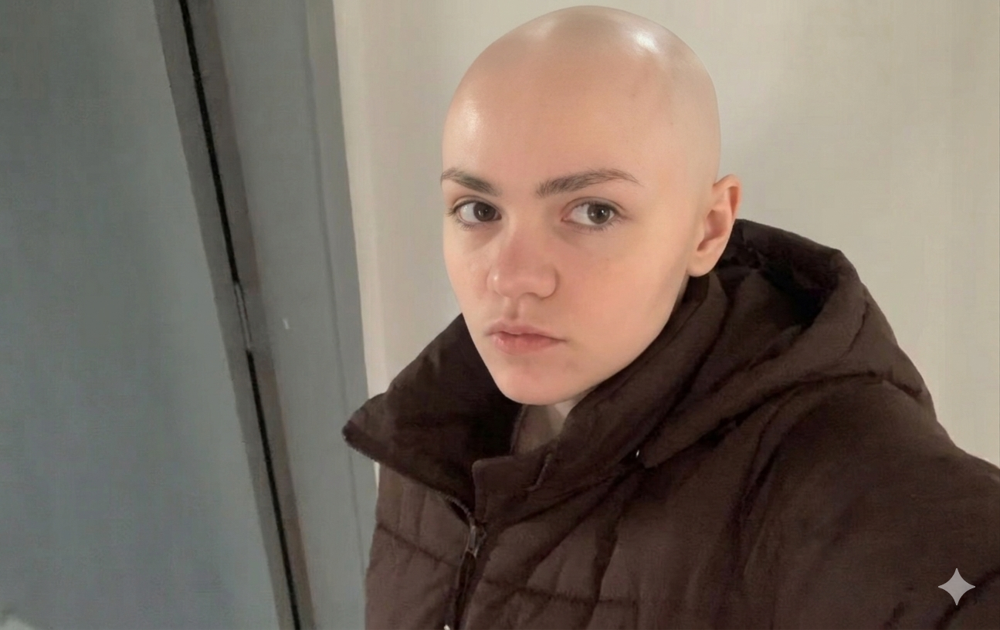

# CarequeIA

> Inteligência Artificial para Carecas — ciência avançada para superfícies brilhantes.

Sistema web criado para hackathon. A CarequeIA recebe uma foto, classifica o usuário como **Careca Elite** ou **Calvo em Evolução**, gera métricas humorísticas, libera um painel exclusivo, galeria de tapas/maquinadas, ranking, ringue de batalhas e certificado oficial em PDF.

## Stack


### Inteligências Artificiais


> **Configuração do PHP:** Habilite `pdo_mysql` e pelo menos uma forma de realizar requisições HTTPS: a extensão `curl` ou `allow_url_fopen` com suporte a OpenSSL.

No Windows, localize o arquivo carregado com:

```bash
php --ini
```

Depois habilite no `php.ini`, removendo o `;` do início das linhas:

```ini
extension=openssl
extension=curl
extension=pdo_mysql
```

## Estrutura

```txt
CARECA/
  api/
    config/
      database-example.php   Modelo de configuracao local
      gemini-example.php     Modelo da chave da API Gemini
      xai-example.php        Modelo da chave da API xAI
    analisar.php             Analise da foto com IA e login
    aplicar-filtro.php       Aplicacao do filtro careca na foto
    interacoes.php           GET galeria com contagem / POST tapa ou maquinada
    posicao.php              Posicao real do usuario no ranking
    ranking.php              Ranking dinamico por tipo
    ringue.php               Lista de oponentes para batalha
    stats.php                Contadores reais da landing page
  assets/
    css/
      style.css              Layout, responsividade e Bald Mode
    images/
      logocareque.jpeg       Logo oficial do sistema
      perfil/                Fotos de perfil dos usuarios
    js/
      nav.js                 Perfil e botao Sair compartilhados
      bald-mode.js           Popup do Bald Mode (MutationObserver)
      index.js               Landing page e stats em tempo real
      login.js               Login por foto conectado ao PHP
      painel.js              Dashboard careca e calvo + certificado PDF
      galeria.js             Galeria de tapas e maquinadas
      ranking.js             Ranking dividido por tipo
      ringue.js              Batalhas, historico e revanche
      app.js                 Analise alternativa (analise.html)
    textos/
      galeria.json           Frases curtas por tipo (careca / calvo)
      ranking.json           Frases do ranking por tipo
      painel-careca.json     Diagnosticos da IA para carecas
      painel-calvo.json      Diagnosticos da IA para calvos
      metricas-careca.json   Configuracao das metricas do painel careca
      metricas-calvo.json    Configuracao das metricas do painel calvo
  database/
    schema.sql               Banco, tabelas e dados de teste
  index.html                 Landing page com stats reais
  login.html                 Login por foto (sem senha)
  galeria.html               Feed de tapas e maquinadas
  ranking.html               Ranking dividido: carecas x calvos
  painel-careca.html         Painel exclusivo Careca Elite
  painel-calvo.html          Painel exclusivo Calvo em Evolucao
  ringue.html                Ringue de batalhas cranianias
  analise.html               Tela de analise alternativa
```

## Preparando o ambiente

1. Instale XAMPP, Laragon ou outro ambiente com PHP e MySQL.
2. Coloque o projeto na pasta pública do servidor.
3. Execute `database/schema.sql` no MySQL.
4. Copie `api/config/database-example.php` para `api/config/database.php`.
5. Ajuste as credenciais no arquivo criado.
6. Copie `api/config/gemini-example.php` para `api/config/gemini.php`.
7. Informe sua chave da API Gemini no arquivo criado.
8. Copie `api/config/xai-example.php` para `api/config/xai.php`.
9. Informe sua chave da API xAI no arquivo criado.
10. Abra o projeto no navegador.

Exemplo com o servidor embutido do PHP:

```bash
C:\xampp\php\php.exe -S localhost:8000
php -S localhost:8000
```

Depois acesse:

```
http://localhost:8000
```

> **Segurança:** Nunca envie `api/config/database.php`, `api/config/gemini.php` ou `api/config/xai.php` para o GitHub. Certifique-se de que estão listados no `.gitignore`.

## Funcionalidades

| Funcionalidade | Descrição |
|---|---|
| 🔍 Login por foto | Sem senha — a IA analisa e classifica automaticamente |
| 🏆 Painel Careca | Métricas de brilho, aerodinâmica e certificado PDF |
| 🌱 Painel Calvo | Barra de progresso, métricas de evolução e certificado PDF |
| 👋 Galeria | Feed estilo Instagram com tapas (carecas) e maquinadas (calvos) |
| 📊 Ranking | Placar dividido: carecas vs calvos com frases zoeiras |
| ⚔️ Ringue | Batalhas cranianas com histórico, revanche e nova foto |
| 🌑 Bald Mode | Modo escuro intencional: tudo preto, revela no hover |
| 🏅 Certificado | PDF com frente (diagnóstico) e verso (métricas) |

## Equipe

<table>
  <tr>
    <td align="center" width="25%">
      <br><br>
      <strong>Gerson</strong><br>
      <sub>Analista de Software Sênior<br>Tech Lead</sub>
    </td>
    <td align="center" width="25%">
      <br><br>
      <strong>Guilherme</strong><br>
      <sub>Estudante de Engenharia de Software</sub>
    </td>
    <td align="center" width="25%">
      <br><br>
      <strong>Thomaz</strong><br>
      <sub>Estudante de Engenharia de Software</sub>
    </td>
    <td align="center" width="25%">
      <br><br>
      <strong>Ketlyn</strong><br>
      <sub>Estudante de Ciência da Computação</sub>
    </td>
  </tr>
</table>
